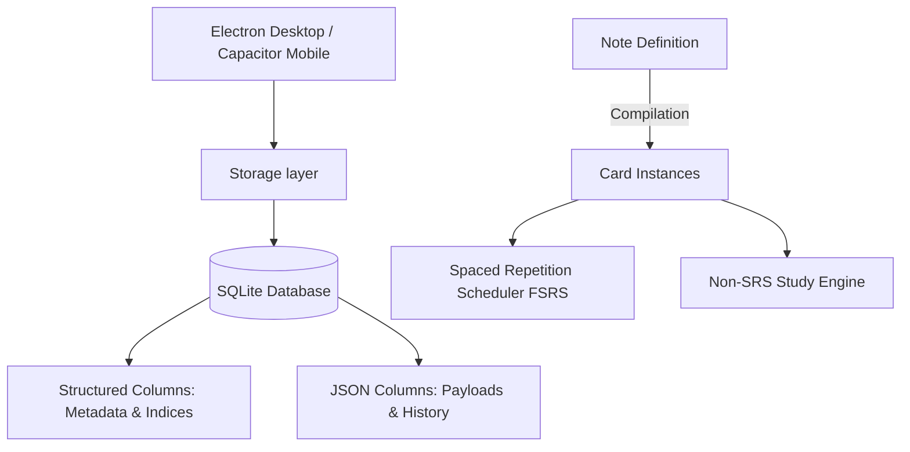

<p align="center">
  
</p>

# Erudite Flashcards

Erudite Flashcards is a local-first, offline flashcard application designed for high-performance active recall and long-term retention. Engineered for both desktop (via Electron) and mobile (via Capacitor/Android), it bridges the gap between Anki-level technical seriousness and modern, fluid user interfaces. 

Erudite allows students to create, review, inspect, and maintain their cards completely locally without requiring cloud accounts, web services, or third-party servers.

---

## Core Product Architecture

Erudite is built from the ground up on three major technical pillars: a relational-document hybrid storage model, a decoupled note-to-card compilation system, and a platform-aware native wrapper layer.



### 1. Relational-Document Hybrid Storage
To combine relational database speed with document-model flexibility, Erudite uses a hybrid SQLite storage schema. Core entities (such as classes, decks, and cards) are indexed using strict primary/foreign key columns, while rich payloads and operational statistics are nested as JSON columns:
- **Relational Integrity**: Columns like `id`, `set_id` (deck reference), and `position` are strictly enforced at the database level to ensure quick indexing, cascades on deletion, and relational queries.
- **Document Payloads**: Extended attributes (such as card templates, cloze indices, image occlusion bounds, and full SRS properties) are stored in standard `payload_json`, `srs_json`, and `review_history_json` document fields, making the schema easily extensible without database migrations.
- **Offline Sync & Tombstones**: Deleted entities leave behind a row in the `tombstones` table containing deletion timestamps and device metadata, ensuring manual backups and offline migrations can resolve synchronization conflicts correctly.

### 2. Note-Based Card Architecture
Instead of storing cards as flat front-and-back string pairs, Erudite decouples content declaration from review execution using a **Note-Based Architecture**:
- **Notes (Source Content)**: Holds the raw user inputs, media references, note types, and fields.
- **Cards (Review Instances)**: Dynamically generated from Notes based on the selected card template. A single Note can produce multiple card instances (e.g. forward and reverse directions) while sharing the same underlying content.
- **Normal vs. Spaced Repetition**: Card reviews can run under two separate contexts:
  - **Normal Mode**: Standard linear, reversed, or randomized study loops without tracking spacing intervals.
  - **SRS Mode**: Governed by the FSRS algorithm, which schedules reviews based on historical intervals. Normal study progress is kept isolated from SRS scheduling to prevent user-driven reviews from inflating spaced-repetition analytics.

### 3. Desktop & Mobile Hybrid Runtime
Erudite compiles down to two distinct application targets:
- **Desktop (Electron)**: Direct access to local SQLite databases using Node.js filesystem drivers.
- **Mobile (Capacitor/Android)**: A hybrid database bridge. On physical devices, it communicates with native Android SQLite using `@capacitor-community/sqlite` for persistent performance. In development and web browser mode, it falls back transparently to an in-memory WebAssembly SQLite engine (`sql.js`).

---

## Supported Note Types

Erudite supports five note templates to accommodate diverse learning styles:

| Note Type | Card Template | Primary Use Case | Output Cards |
| :--- | :--- | :--- | :--- |
| **Basic** | `front-back` | Standard Q&A, definitions, basic vocabulary | 1 card |
| **Basic (and reversed card)** | `bidirectional` | Language learning, terminology, associations | 2 cards (Forward & Reverse) |
| **Cloze** | `cloze-deletion` | Context-based fill-in-the-blanks | 1 card per deletion |
| **Image Occlusion** | `occlusion` | Anatomy, geography, diagrams, charts | 1 card per occluded shape |
| **Advanced HTML/CSS** | `custom-visual` | Custom designs, tables, structured visual layouts | 1 card |

### Advanced HTML/CSS Cards & Security
For complex, highly visual cards, Erudite provides a custom HTML/CSS engine. Users can write tailored layouts and style sheets directly. To maintain device security and performance, Erudite enforces the following constraints:
- **Shadow DOM Isolation**: The custom front and back HTML cards are rendered inside an isolated `ShadowRoot` host element. This prevents user-defined stylesheets from bleeding into and breaking the main application shells.
- **Strict CSS Sanitization**: Custom CSS is parsed to strip out `@import` declarations, external background URL resources, expression blocks, and absolute z-indexes, keeping the styling locally bound.
- **Strict HTML Sanitization**: All HTML payloads pass through a parser that strips out `<script>` tags, inline scripts, event attributes (e.g., `onclick`, `onload`), external resource links, and dangerous elements to prevent cross-site scripting (XSS) and layout exploits.

---

## Spaced Repetition & Study Engines

### FSRS Scheduling Algorithm
Erudite incorporates the **Free Spaced Repetition Scheduler (FSRS)** algorithm (utilizing the `ts-fsrs` library) as its spacing engine:
- **Feedback Loop**: When reviewing in SRS mode, users rate card retention across four standard options: *Again*, *Hard*, *Good*, and *Easy*.
- **Parameter Control**: Supports requested retention ratios (from 0.70 to 0.99) and maximum interval limits (defaulting to 100 years).
- **Fuzzing & Short-Term Steps**: Includes scheduler fuzzing (adding minor random offsets to long-term intervals to prevent large card clusters from landing on the same day) and short-term learning steps for new or forgotten cards.

### Study Statistics & Insights
The Today dashboard provides statistical summaries of study progress:
- **Study Heatmaps**: Tracks daily study sessions over time.
- **Retention Analytics**: Tracks button distribution history (Again/Hard/Good/Easy ratios) to measure performance.
- **Leech Detection & Deck Health**: Automatically highlights "leech" cards (cards that have been failed repeatedly) and displays a composite deck health ratio to gauge subject familiarity.
- **Review Forecasts**: Generates predictive workload curves mapping out expected daily review loads up to 30 days into the future.

---

## Project Structure

```text
.
|-- android/                     Native Android Gradle wrapper and Capacitor configuration
|-- assets/                      Visual icons, splash assets, and logos
|-- css/                         Desktop styles for Electron windows
|-- js/
|   |-- core/                    Core logic: schema normalization, SRS APIs, backup modules
|   |-- mobile/                  Mobile database connection wrapper and file handlers
|   |-- storage-client.js        Electron local IPC storage client
|   `-- srs-manager.js           FSRS calculation implementation
|-- mobile/                      Capacitor mobile application HTML, CSS stylesheets, and JS
|-- scripts/                     Bundling and build scripts
|-- storage/                     Desktop SQLite relational schema and queries
|-- www/                         Output directory for compiled mobile web assets
|-- main.js                      Electron main process lifecycle coordinator
|-- preload.js                   Electron context bridge definition
`-- package.json                 Dependencies and developer scripts
```

---

## Development & Build Guide

Erudite uses `npm` as its package manager. Ensure Node.js is installed on your local development system.

### 1. Installation
Install project dependencies:
```powershell
npm.cmd install
```

### 2. Running the Desktop Application
Launch Electron in development mode:
```powershell
npm.cmd start
```

### 3. Compiling Mobile Web Assets
Compile HTML/CSS/JS and assets into the output `www/` build folder:
```powershell
npm.cmd run build:mobile
```

### 4. Syncing to Android Studio
Copy the compiled web assets and plugin configurations into the native Android Gradle project:
```powershell
npm.cmd run cap:sync
```

To open Android Studio with the native Capacitor workspace:
```powershell
npm.cmd run cap:open
```

### 5. Compiling Android Debug APK
To assemble the debug build via command line:
```powershell
cd android
$env:JAVA_HOME='C:\Program Files\Android\Android Studio\jbr'
.\gradlew.bat :app:assembleDebug
```

---

## Comparison with Anki

Erudite is designed as a focused, modern spaced repetition tool:

### Why Erudite is a compelling alternative:
- **Modern User Experience**: A clean, single-page flow designed for smooth desktop and mobile interactions, avoiding complex menus.
- **Flexible Study Options**: Separation between normal review loops and spaced repetition scheduler modes.
- **Rich Dashboard Insights**: Built-in visual analytics covering heatmaps, review forecast distributions, leech counts, and composite deck health stats without requiring community add-ons.
- **Simplified Mobile Creator**: Native drawing canvas for visual image occlusion and markdown-supported rich text authoring.

### Where Anki remains the standard:
- **Mature Ecosystem**: Anki has decades of development, extensive community add-ons, and a vast collection of public shared decks.
- **Centralized Cloud Syncing**: AnkiWeb provides a battle-tested central service for cross-device syncing, whereas Erudite currently relies on manual backups and offline imports.
- **Advanced Custom Templates**: Anki's template engine is highly flexible, supporting custom scripts and broad visual variations.

---

## License

Business Source License 1.1. See [LICENSE](LICENSE) for terms.

## Author

**Sambhav Jain**  
eruditespartan@gmail.com
