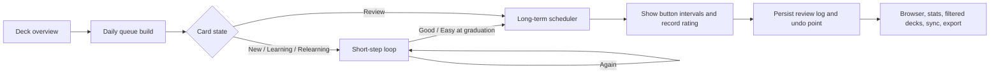
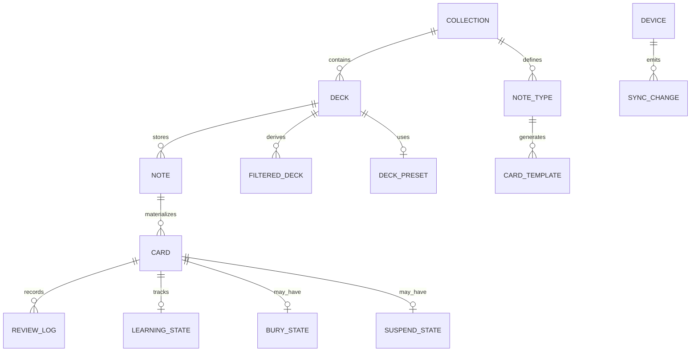

# Erudite Roadmap to Anki-Level SRS

## Executive summary

Anki is great not because it has one magical scheduler, but because it wraps scheduling in a mature operating system for memory work: explicit learning and relearning steps, sane day boundaries, bury/suspend controls, filtered decks and custom study, a powerful browser, reliable sync and export/import, rich retention analytics, and an unusually deep extension surface. Even with FSRS available, Anki still exposes learning steps, lapses, filtered-deck preview modes, note/card semantics, and bulk operational tools, because real-world spaced repetition depends as much on queue control, friction reduction, and recoverability as it does on interval math. citeturn3view1turn5view1turn6view0turn7view4turn25view0turn25view1

Erudite already has a solid base. The uploaded code shows a local-first SQLite-backed architecture on desktop and mobile, persisted progress/state, backup support on mobile, revision metadata and tombstones in the desktop schema, a metadata-only listing path (`listSetsMeta`) for performance, and card-level fields for `suspended`, `buriedUntil`, `srs`, and `reviewHistory`. It also already uses `ts-fsrs` as the scheduling engine, which is the right place to be if your goal is Anki-class review quality without re-inventing scheduler math. fileciteturn0file7 fileciteturn0file8 fileciteturn0file6 fileciteturn0file9

The biggest gap is not “FSRS quality.” It is product architecture. Based on the uploaded audit and code, Erudite still needs a first-class short-term learning queue, true day-based limits and rollover semantics, undo, richer card actions, filtered/custom study, a serious browser, sync conflict resolution, better analytics, and a plugin model. The single most important structural enabler, if you want true Anki-level behavior rather than only “Anki-like scheduling,” is introducing a **note/card split** instead of a purely card-centric model; without that, sibling burying, template-generated cards, note-level editing, and browser semantics remain awkward. citeturn4view3turn6view0 fileciteturn0file8 fileciteturn0file9

A good target is not “clone Anki pixel-for-pixel.” It is to reach the same **operational reliability**, **review speed**, and **power-user ceiling**: the app should let a beginner review fast with almost no thinking about the software, while giving advanced users enough visibility and control to recover from errors, shape their workload, study for a deadline, and trust the data across devices. Research on spaced practice and review scheduling supports that surrounding mechanics matter: distributed practice beats massing, and the balance between new-item introduction and review capacity can create sharp drops in learning outcomes when overloaded. citeturn13academia1turn15academia8turn15academia7

## What makes Anki great in practice

The historical lineage of spaced repetition is often framed as moving from Pimsleur’s graduated early intervals, through SuperMemo’s interval optimization work, into modern memory-dynamics approaches such as FSRS. But Anki’s real competitive advantage is that it operationalizes that lineage with a complete study workflow rather than only a formula. citeturn15search3turn16search1turn20view0

Anki keeps acquisition and long-term scheduling distinct. In deck options, learning steps and relearning steps are still first-class controls, and “Again” returns a learning card to the first step. Daily limits, display order, burying, lapses, FSRS settings, and advanced scheduling controls all live in one coherent options model. That matters because short-term acquisition loops and review queue controls shape user experience more directly than the long-term interval formula does. citeturn3view1

Anki also makes reviews fast. The answer buttons show the next interval, the core shortcuts are consistent, the “More” menu exposes operational actions such as bury, suspend, reset, set due date, and card info, and the browser gives a power-user surface for search, bulk actions, sorting, and filtered-deck creation. These features reduce the cost of correcting mistakes and recovering from messy real-life study patterns. citeturn4view1turn4view3turn4view4turn4view5turn6view0

Filtered decks and custom study are a major reason Anki feels robust instead of rigid. The official manual describes using them for previewing, cramming before a test, focusing on particular tags, catching up a backlog with a chosen sort order, reviewing ahead, or revisiting failed cards. It also distinguishes between rescheduling mode and preview mode, which is crucial for safe “study outside normal scheduling” workflows. citeturn5view1turn5view2turn5view4turn5view5

Anki’s observability is unusually good. The stats UI includes future due, reviews, card counts, review time, intervals, ease/stability/difficulty/retrievability, answer buttons, and a true-retention table. The browser has configurable columns like due date, interval, lapses, reviews, deck, tags, and last modification. That turns the system from a black box into something users can calibrate and trust. citeturn7view4turn7view5turn6view0

Finally, Anki is extensible by design. Official add-on docs say add-ons are loaded as Python modules at startup and connect through hooks and filters. The hook docs and generated hook source show explicit reviewer, deck-options, filtered-deck, webview, and browser extension points, while Anki’s operation helpers update undo state, commit changes, and refresh UI after background operations. That combination of stable extension points and strong core workflows is what creates the “there is probably an add-on for that” ecosystem effect. citeturn25view0turn25view1turn10view1turn12view1turn12view2

This is the practical shape of the system Anki gives users:

The academic literature points in the same direction. Spaced practice is robustly better than massed practice; queue design must balance new introductions against review capacity; and richer models of forgetting can improve prediction when skill or item structure matters. In product terms, that means the scheduler should sit inside a workload-management system, not stand alone. citeturn13academia1turn15academia8turn15academia7

## What Erudite already has

Erudite’s current foundation is much better than a typical hobby flashcard app. The uploaded materials show FSRS integration, persistent per-card SRS data, persisted review history, deck-level SRS settings, and queue filtering for suspended and buried cards. The uploaded audit also identifies the right problem areas, which suggests the project already has a realistic view of where the remaining work is. fileciteturn0file9

The storage story is promising. The desktop SQLite store has explicit tables for classes, sets, cards, settings, progress, state, and tombstones, plus per-record `rev` and `device_id` fields. The mobile store mirrors the same broad model on top of Capacitor/sql.js, keeps emergency local mirrors, and supports backup export/import. That is not yet an Anki-class sync system, but it is a credible base for one. fileciteturn0file8 fileciteturn0file7

Performance groundwork is also present. Both stores expose a metadata-only deck listing path, and the desktop schema includes useful indexes on visible sets and cards-by-set-position. That means you already have at least part of the data-access design needed for large libraries; the next step is to make the UI consistently use those cheaper paths. fileciteturn0file8 fileciteturn0file7

Analytics exist, but they are still lightweight. The stats module computes total cards, state counts, due counts, next due, and a thirty-day retention percentage, while the mobile store computes richer metadata such as review counts, reviewed-today, remembered-thirty, and a limited-due estimate. Useful start. Not yet enough for Anki-grade calibration. fileciteturn0file6 fileciteturn0file7

Accessibility and parity are partially underway. The current code includes keyboard-based study controls and a high-contrast theme option in settings normalization. At the same time, mobile explicitly marks delimited import/export as unsupported, which shows parity gaps at the capability level. fileciteturn0file7

The main conclusion is encouraging: Erudite does **not** need a scheduler rewrite. It needs a stronger product shell around the scheduler. That is exactly the kind of work that tends to produce the biggest user-perceived leap. fileciteturn0file9

## Gap analysis against Anki

The table below maps high-value Anki capabilities to Erudite’s current status as supported by the uploaded code and audit, then gives the most direct next action.

| Anki feature | Erudite current status | Recommended action |
|---|---|---|
| Learning steps and relearning steps | **Partial.** Erudite has FSRS scheduling, but the uploaded audit reports that failed cards are not re-shown inside the same session and that active learning can be mishandled by queue logic. Anki keeps learning/relearning steps explicit even with FSRS. citeturn3view1 fileciteturn0file9 | Add a dedicated short-term learning queue on top of FSRS, with immediate or near-immediate requeue on `Again`, graduate/relearn step tracking, and separate handling from mature review cards. |
| Daily limits and day rollover | **Partial.** Erudite has per-deck new/review limits in settings, but the audit flags per-session limit behavior and strict timestamp due checks. Anki treats limits as daily controls and documents day-boundary behavior. citeturn3view1 fileciteturn0file9 | Introduce an SRS-day ledger keyed by local day + rollover hour, and compute remaining new/review budget from review logs rather than current queue slices. |
| Bury/suspend | **Partial.** Erudite stores `suspended` and `buriedUntil`, and queue filters respect them, but the uploaded code does not show Anki-style manual actions or sibling burying behavior. citeturn4view3turn4view4 fileciteturn0file7 fileciteturn0file8 | Add manual bury/suspend/unbury actions and, after introducing note/card semantics, automatic sibling bury rules. |
| Note/card separation | **Missing as a first-class model.** The uploaded desktop schema exposes classes, sets, and cards, but no note/notetype/card-template layer. Anki’s browser and sibling behavior assume note/card distinction. citeturn4view3turn6view0 fileciteturn0file8 | Introduce notes, note types, and card templates. This is the key structural prerequisite for sibling bury, cloze/image occlusion, note-level editing, and a serious browser. |
| Filtered decks and custom study | **Not evidenced in the uploaded files.** Anki uses filtered decks for backlog control, preview, review ahead, and failed-card review. citeturn5view1turn5view2turn5view4 fileciteturn0file8 | Build filtered decks as saved or ephemeral search-driven virtual decks with reschedule vs preview modes. |
| Session undo | **Missing.** The audit explicitly calls out lack of an undo action. Anki’s operations system is designed around undo-aware mutations. citeturn6view0turn12view1 fileciteturn0file9 | Add a review undo stack with reversible card-state and queue mutations, persisted at least for the current session. |
| Keyboard shortcuts and fast review ergonomics | **Basic.** Erudite has study shortcuts, but the uploaded audit still reports UX limitations, and the broader Anki shortcut surface is much richer. citeturn4view1turn4view3 fileciteturn0file9 | Complete the shortcut map, expose it in UI, support remapping later, and make review actions available without pointer travel. |
| Progress model | **Basic.** Current Erudite progress is tied to current index and total length; the audit highlights resume/skip problems. Anki’s practical model is “what is left today” rather than raw index position. fileciteturn0file9 | Use dynamic “completed / remaining / hidden by bury / postponed by limit” progress, with session recovery based on queue identity, not only index. |
| Card browser | **Unclear/partial from the uploaded set.** The browser implementation itself was not part of the uploaded code I could verify, while Anki’s browser is a central power-user tool with notes/cards mode, saved searches, columns, sort, and bulk actions. citeturn6view0 | Build or harden a browser with search DSL, saved searches, bulk actions, and both note- and card-oriented workflows once notes exist. |
| Reset / set due / bulk repair tools | **Not evidenced as a full subsystem.** Anki exposes reset, set due date, reposition, and changing deck from the browser and study “More” menu. citeturn4view5turn6view0 | Add bulk repair tools early; these are disproportionately important for user trust. |
| Sync and conflict handling | **Groundwork only.** The desktop schema has `rev`, `device_id`, and `tombstones`, but no uploaded remote sync transport, merge engine, or conflict UI. Anki merges most changes, uses one-way sync for unmergeable cases, and treats media separately. citeturn7view7turn7view8 fileciteturn0file8 | Implement a real sync protocol, conflict classification, and “force upload/download” recovery paths. |
| Analytics and true retention | **Partial.** Erudite currently exposes state counts, retention summaries, and next-due metrics, but not Anki’s true-retention table or richer review graphs. citeturn7view4turn7view5 fileciteturn0file6 fileciteturn0file7 | Add revlog-driven analytics: true retention, workload forecast, review time, intervals, answer-button mix, and backlog slices. |
| Add-on / plugin architecture | **Missing.** No hook or extension model was evident in the uploaded Erudite files. Anki explicitly documents hooks, filters, add-on loading, and generated hook definitions. citeturn25view0turn25view1turn10view1turn12view2 | Design a stable extension API with manifest, permissions, lifecycle hooks, and sandboxing. |
| Mobile/desktop parity | **Partial.** Shared storage concepts exist across desktop/mobile, but mobile explicitly marks delimited import/export unsupported. fileciteturn0file7 fileciteturn0file8 | Introduce a capability matrix and parity tests so “unsupported” becomes deliberate, temporary, and visible to product planning. |
| Performance/scalability | **Good groundwork, incomplete delivery.** SQLite tables and indexes exist, and both stores expose metadata-only listing paths. fileciteturn0file7 fileciteturn0file8 | Move the library and browser to metadata-first loading, normalize review logs, and add due/state indexes for collection-scale usage. |
| Export/import | **Partial.** Mobile has JSON backup export/import, but mobile delimited import/export is explicitly unsupported; Anki supports collection packages, deck packages, and plain text export, with optional scheduling info. citeturn7view9turn7view10turn7view11 fileciteturn0file7 | Standardize backup and interchange formats across platforms, including “with scheduling” and “without scheduling” modes. |
| Security/privacy | **Mixed.** Erudite is local-first, which is good, but the uploaded stores show no encryption-at-rest, and mobile keeps emergency mirrors in local storage alongside the SQLite database. fileciteturn0file7 fileciteturn0file8 | Add encryption options, secure-key storage, and tighter handling of backup mirrors and sync credentials. |

## Recommended roadmap for Erudite

The following roadmap is the shortest path I see to “Anki-level” user trust and capability. I have deliberately prioritized app-level behavior, UX, and engineering practice over scheduler math.

This target model is worth adopting because Anki’s most valuable features—sibling burying, note-level editing, multiple card templates, filtered decks, browser modes, and reliable bulk operations—fit naturally once cards are generated from notes instead of being the only authoring entity. citeturn4view3turn6view0 fileciteturn0file8

| Recommended change | Rationale | Implementation approach | Priority | Effort | Potential pitfalls |
|---|---|---|---|---|---|
| Build a dedicated **ReviewQueue** service with learning/relearning loops and session undo | This is the highest-leverage improvement because today’s review feel depends on queue behavior more than on interval math. The uploaded audit’s “Again trap,” resume issues, and lack of undo all point here. fileciteturn0file9 | Separate `new`, `learn`, `review`, and `relearn` lanes. Keep FSRS as the long-term scheduler, but manage short-term loops in app code. Record each answer as an atomic operation with `before` and `after` states so undo can reverse both queue mutation and SRS state. | P0 | Medium | Queue duplication, unstable resume semantics, and race conditions between persistence and in-memory queue updates. |
| Add an **SRS-day service** with rollover hour and log-derived daily limits | Anki’s day-boundary behavior and daily limits are central to keeping workload predictable, and review-load research shows the new-vs-review balance matters sharply. citeturn3view1turn15academia8 | Implement `getSrsDay(now, timezone, rolloverHour)`. Derive `newStudiedToday` and `reviewsDoneToday` from an append-only review log, not from the current queue or current card states. Support deck-level presets and “today only” overrides later. | P0 | Medium | DST/timezone bugs, inconsistent device clocks, and migration from legacy `reviewHistory` arrays. |
| Introduce a **note / note-type / card-template** layer | Without notes, you can approximate Anki’s scheduling, but not Anki’s model. Sibling bury, multi-card generation, cloze, image occlusion, and note-level browser workflows depend on it. citeturn4view3turn6view0 fileciteturn0file8 | Add `notes`, `note_types`, `card_templates`, and generated `cards`. Store media/fields at note level where appropriate. Preserve legacy card-only decks by migrating each card into a single-note/single-card type at first. | P0 | Large | Migration complexity, authoring UI redesign, and temporary duplication of old/new models during rollout. |
| Add **bury, suspend, unbury, reset, and set-due** as first-class actions | Power users trust Anki because mistakes are repairable. These actions are both essential UX and essential safety valves. citeturn4view3turn4view4turn4view5turn6view0 | Create a card-actions service callable from study mode and browser mode. Keep every action undoable. After notes exist, add sibling bury by note and optional leech workflows. | P0 | Medium | Users can break their schedules if the semantics are unclear; action copy and warnings matter. |
| Ship **filtered decks** and **custom study** | This is one of Anki’s signature operational tools for backlogs, exams, preview, and focused review. citeturn5view1turn5view2turn5view4 | Model filtered decks as saved searches plus execution parameters: limit, sort order, second filter, and `preview` vs `reschedule` mode. Keep “home deck” identity on every card so cards can safely return. | P1 | Large | Search semantics, duplicate pulls, interaction with bury/suspend, and confusion around whether answers should reschedule. |
| Build a real **card browser** with saved searches and bulk operations | Anki’s browser is not optional plumbing; it is the maintenance console for the whole system. citeturn6view0 | Start with columns for deck, tags, due, interval, lapses, reviews, state, suspended, buried, and last review. Add saved searches, fast filters, bulk actions, and later card-vs-note mode. Keep query execution SQLite-native where possible. | P1 | Large | Browser performance on large libraries, query-language creep, and too much UI complexity at once. |
| Normalize review logs into an append-only **review_log** store | Embedded `reviewHistory` arrays are workable early on, but they age badly for analytics, sync, and conflict handling. The uploaded stores already persist review history inside cards, which will become expensive and fragile as collections grow. fileciteturn0file7 fileciteturn0file8 | Create a separate `review_log` table with immutable events: answer time, rating, old/new state, due before/after, elapsed, session id, deck id, card id. Keep card rows as current state only. Backfill gradually from existing arrays. | P1 | Medium | Migration cost, double-write complexity during transition, and log growth without pruning/compression policy. |
| Implement **sync with conflict classes**, not just sync transport | Anki distinguishes mergeable vs unmergeable changes and falls back to one-way sync when necessary. That is a product policy as much as a protocol detail. citeturn7view7turn7view8 | Use entity revisions plus tombstones as a base, but add a sync journal or change feed. Classify conflicts into: auto-merge, ask-user, and destructive-schema-change. Sync media separately. Add “force upload/download” recovery. | P1 | Large | Clock skew, deletion resurrection, schema-version conflicts, and hard-to-debug partial failures on mobile networks. |
| Expand analytics to **true retention, workload forecasting, and FSRS diagnostics** | Anki’s stats help users calibrate trust in the algorithm. Research also supports monitoring review load and distinct retention regimes rather than only a crude pass rate. citeturn7view4turn7view5turn15academia7 | Add dashboards for true retention by young/mature cards, answer-button distribution, daily review time, due forecast, backlog slices, and stability/difficulty/retrievability histograms. Compute them from `review_log`, with cached aggregates for speed. | P1 | Medium | Misleading metrics if definitions are sloppy, and slow dashboards without pre-aggregation. |
| Design a **plugin architecture** with stable hooks and permissions | One reason Anki keeps getting better is that users can fill gaps without forking. The official docs and source expose hooks across reviewer, browser, deck options, filtered decks, and webviews. citeturn25view0turn25view1turn10view1turn12view2 | Do not copy Anki’s Python model directly. Instead, define a manifest-based extension API for Electron/web/Capacitor: lifecycle hooks, browser columns, study hooks, search filters, import/export pipeline hooks, and sandboxed web assets. Permission-gate filesystem/network access. | P1 | Large | Security, API drift, startup cost, and ecosystem breakage if hooks are unstable. |
| Enforce **mobile/desktop capability parity** with feature flags and tests | The mobile store already exposes explicit unsupported operations, which is honest, but parity should become an engineering discipline. fileciteturn0file7 | Create a platform capability matrix and cross-platform acceptance tests for core flows: review, undo, export/import, backup, filtered decks, browser actions, and sync recovery. Features may degrade, but behavior should degrade predictably. | P1 | Medium | Platform-specific file APIs, background execution limits, and UX inconsistency across shells. |
| Turn existing SQLite groundwork into real **collection-scale performance** | Large-collection speed is a meaningful part of Anki’s reputation. Erudite’s stores already have indexes and metadata-only listing paths, so the next gains are practical, not speculative. fileciteturn0file7 fileciteturn0file8 | Use metadata-only deck loading on library screens, lazy-hydrate cards when entering study/browser, index by due/state/deck, batch writes, and run expensive aggregates in background workers. Add collection diagnostics and integrity checks. | P1 | Medium | Cache invalidation, stale derived counts, and write amplification if review commits are too chatty. |
| Upgrade accessibility and review ergonomics | Erudite already has some keyboard controls and a high-contrast theme, but Anki-level usability depends on speed and inclusiveness across desktop and touch contexts. fileciteturn0file7 fileciteturn0file9 | Add semantic labels and live regions, consistent focus order, reduced-motion support, larger touch targets, color-independent status cues, fully discoverable shortcuts, and optional one-handed answer layouts on mobile. | P2 | Medium | Accidental UI regressions if accessibility is patched incrementally instead of tested systematically. |
| Standardize **export/import and privacy/security** | Anki’s export model is trusted because users can back up a whole collection, export a deck, or share notes with or without scheduling. Erudite’s mobile backup is a good start, but platform parity and privacy hardening are still needed. citeturn7view9turn7view10turn7view11 fileciteturn0file7 fileciteturn0file8 | Offer full-collection backup, single-deck export, and delimited note export on all platforms. Add optional encrypted backups, secure secret storage, clearer restore previews, and fewer plaintext recovery mirrors on mobile. | P2 | Medium | Encryption key recovery UX, cross-version import compatibility, and making backups safer without making restores scary. |

## Open questions and limitations

Some product areas were only partially visible in the uploaded source set. In particular, I did not have a verifiable implementation file for Erudite’s card browser UI, nor a visible remote sync client/server implementation, nor a complete desktop wrapper for all export/import actions. Where that evidence was incomplete, I marked the current status as **partial**, **unclear**, or **not evidenced in the uploaded files** rather than assuming absence. fileciteturn0file7 fileciteturn0file8

I also found much stronger primary-source coverage for Anki’s current product behavior, extension system, and modern memory/scheduling literature than for historically older Pimsleur and early SuperMemo texts in directly accessible first-party form during this pass. I therefore used the Anki manual, Anki source/add-on docs, and newer academic scheduling work as the primary analytical base, while treating the Pimsleur/SM-2 lineage as historical context rather than the main decision driver. citeturn3view1turn5view1turn6view0turn7view4turn25view0turn25view1turn13academia1turn15academia8turn15academia7

If you implement only three things first, I would make them: **a real short-term review queue with undo**, **an SRS-day ledger with rollover and proper daily limits**, and **a note/card data model**. Those three changes will move Erudite furthest toward the thing users actually mean when they say “Anki-level.” citeturn3view1turn6view0turn7view4 fileciteturn0file8 fileciteturn0file9